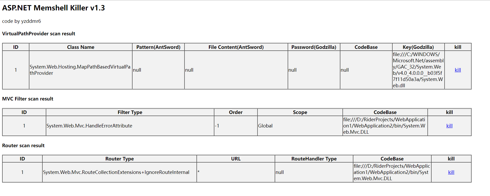
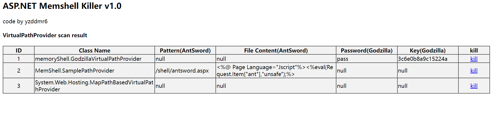

# ASP.NET-Memshell-Scanner v1.3
 asp.net内存马检测工具，通过aspx脚本来实现asp.net内存马的检测以及查杀。

核心代码来源于：[yzddmr6/As-Exploits](https://github.com/yzddmr6/As-Exploits)

前端样式风格参考：[c0ny1/java-memshell-scanner](https://github.com/c0ny1/java-memshell-scanner)

## 支持类型

* VirtualPath内存马
* ASP.NET MVC Filter内存马
* Router内存马

## 使用

上传aspx-memshell-scanner.aspx到web目录，浏览器访问即可。

### 默认情况

注意：请勿删除默认组件，否则会导致网站崩溃。

### 存在内存马的情况

其中类名为memoryShell.GodzillaVirtualPathProvider为哥斯拉的内存马

MemShell.SamplePathProvider为蚁剑的内存马

### 清除内存马

点击kill，提示操作成功，即可删除内存马。

## 系列文章

[ASP.NET下的内存马(1) filter内存马](https://yzddmr6.com/posts/asp-net-memory-filter/)

[ASP.NET下的内存马(2) Route内存马](https://yzddmr6.com/posts/asp-net-memory-shell-router/)

[ASP.NET下的内存马(3) HttpListener内存马](https://yzddmr6.com/posts/asp-net-memory-shell-httplistener/)

[ASP.NET下的内存马(4) VirtualPath内存马](https://yzddmr6.com/posts/asp-net-memory-shell-virtualpath/)

## 更新日志

### v1.4 (2023.8.22)

* 采用assembly加载的方式，防止部分环境下缺失依赖

### v1.3 (2022.4.17)

* 增加filter router内存马卸载功能

### v1.2 (2022.1.24)

* 增加Router内存马检测

### v1.1 (2022.1.15)

* 增加MVC filter内存马检测
* 新增CodeBase信息

### v1.0 (2021.12.19)

* release